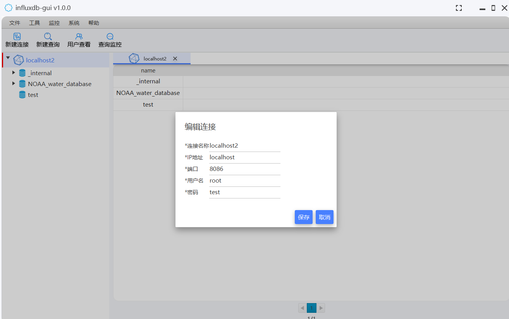
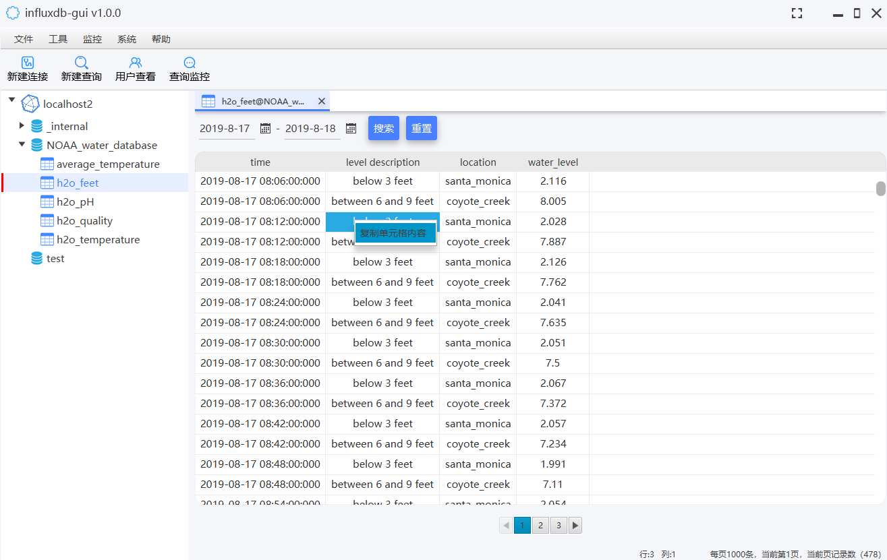
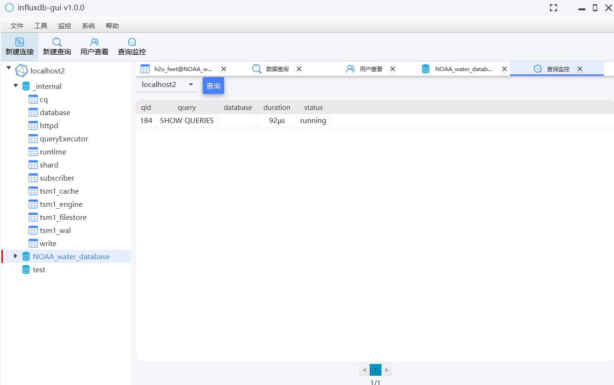

	

<h1 align="center" style="margin: 30px 0 30px; font-weight: bold;">InfluxDB-GUI v1.1.0</h1>

A free and open-source graphical user interface tool for the InfluxDB temporal database, providing users with an intuitive and easy-to-use database management and operation experience!

----
English | [简体中文](README.md)

#### Description
InfluxDB GUI is a comprehensive and easy-to-use graphical interface tool for InfluxDB temporal databases. Currently, V1.0.0 supports the following versions of InfluxDB:
1. Influxdb 1.8.10 version

Main functions:
1. Data connection maintenance (adding, modifying, querying, deleting)
2. Database maintenance (adding, querying, deleting)
3. Measurement maintenance (querying, deleting)
4. Measurement data query (supports querying by time and automatic pagination display)
5. Data operation (copying field values)
6. Custom SQL execution (can execute updated SQL or query SQL, display query results, execution time, error information, etc.)
7. User View
8. Query monitoring (monitoring executing query SQL)

#### Software Architecture

Using JavaFX to Implement UI Functions.

#### Installation

1.  Download the latest version from the distribution, unzip it, and double-click to execute the Influxdb gui. exe file（ https://gitee.com/dbquery/influxdb-gui/releases ）

#### Instructions

1. Initial interface

2. Data connection maintenance (adding, modifying, querying, deleting)

3. Database maintenance (adding, querying, deleting)

4. MEASUREMENT maintenance (querying, deleting)

5. MEASUREMEN TData query (supports querying by time and automatic pagination display)

6. Data operation (copying field values)

7. Custom SQL execution (capable of updating or querying SQL, displaying query results, execution time, error information, etc.)

8. User View

9. Query monitoring (monitoring executing query SQL)

####Contribution

Fork the repository
Create Feat_xxx branch
Commit your code
Create Pull Request
