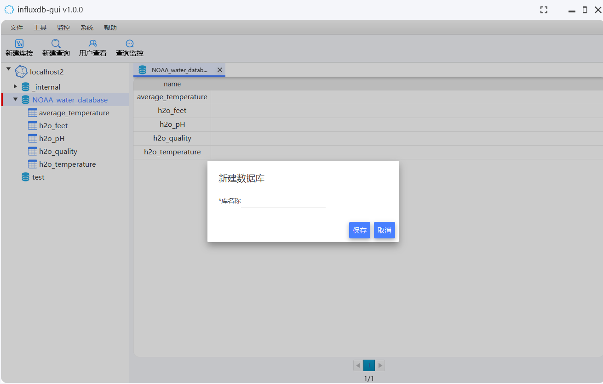

	

<h1 align="center" style="margin: 30px 0 30px; font-weight: bold;">InfluxDB-GUI v1.1.0</h1>

免费开源的influxdb时序数据库图形用户界面工具，为用户提供直观、易用的数据库管理和操作体验！

----

简体中文|[English](README.en.md)

#### 介绍
InfluxDB-GUI是一款功能全面、操作简便的influxdb时序数据库图形界面工具，V1.0.0目前支持influxdb版本列表如下：
1. influxdb 1.8.10版本

主要功能：
1. 数据连接维护（新增、修改、查询、删除）
2. 数据库维护（新增、查询、删除）
3. MEASUREMENT维护（查询、删除）
4. MEASUREMENT数据查询（支持按时间查询，自动分页展示）
5. 数据操作（复制字段值）
6. 自定义SQL执行(可执行更新SQL或查询SQL，可展示查询结果、执行耗时、错误信息等) 
7. 用户查看
8. 查询监控（监控正在执行的查询SQL）
#### 软件架构
基于JavaFX实现UI功能。

#### 安装教程

1.  从发行版中下载最新版本，解压，双击执行influxdb-gui.exe文件即可(https://gitee.com/dbquery/influxdb-gui/releases)

#### 使用说明

1. 初始界面

2. 数据连接维护（新增、修改、查询、删除）

3. 数据库维护（新增、查询、删除）

4. MEASUREMENT维护（查询、删除）

5. MEASUREMENT数据查询（支持按时间查询，自动分页展示）

6. 数据操作（复制字段值）

7. 自定义SQL执行(可执行更新SQL或查询SQL，可展示查询结果、执行耗时、错误信息等) 

8. 用户查看

9. 查询监控（监控正在执行的查询SQL）

#### 参与贡献

1.  Fork 本仓库
2.  新建 Feat_xxx 分支
3.  提交代码
4.  新建 Pull Request
